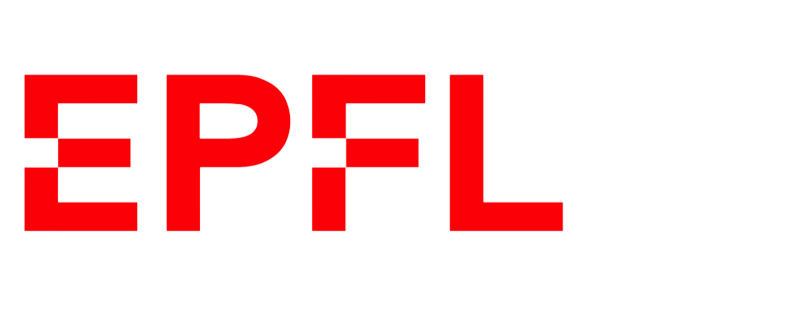

<p align="center" style="display:flex; justify-content:center; width:100%;">
    <a href="https://www.hug.ch/"></a>
    <a href="https://www.epfl.ch"></a>
</p>

# Asthmoscope-MDPI-2025
This is the code accompanying the publication:

>Heidi Cleverley-Leblanc et al. 2025.
[Enhancing pediatric asthma homecare management: The Potential of Deep Learning associated with spirometry-labelled data.](https://www.mdpi.com/2076-3417/15/19/10662)
_Applied Sciences_, _15_(19), p.10662

## Installation

This project uses [`uv`](https://docs.astral.sh/uv/) for dependency management. Install it first:

```bash
curl -LsSf https://astral.sh/uv/install.sh | sh
```

Then install the project and its dependencies:

```bash
uv sync
uv pip install -e .
```

## Usage

### 0. Prepare Data (First Time Only)

Before training or evaluating, prepare the experiment data files:

```bash
uv run python src/prepare_experiment_data.py \
  --download-path /path/to/raw/data \
  --data-drive-path /path/to/processed/data \
  --clinical-data /path/to/clinical_data.csv \
  --data-dictionary /path/to/data_dictionary.csv
```

This creates:
- `experiments/asthmoscope_mdpi_2025/out/data_files/patient_df.csv`
- `experiments/asthmoscope_mdpi_2025/out/data_files/samples_df.csv`
- `experiments/asthmoscope_mdpi_2025/out/data_files/audio_data.npy`

<details>
<summary><b>📋 Data Format Requirements (click to expand)</b></summary>

**Note:** Our `prepare_experiment_data.py` script is specific to our data organization and file naming conventions. You'll likely need to write your own data preparation pipeline adapted to your data structure. Here are the requirements of each file:

#### 1. `patient_df.csv` - Patient-level metadata

A CSV file with one row per patient.

**Required columns:**
- `patient` (str): Unique patient identifier
- `asthma` (int): Binary target label (0 = control, 1 = case/asthma)
- `fold` (int): Cross-validation fold assignment (0-4 for 5-fold CV)
- `location` (str): Data collection site/location identifier

**Optional columns:**
- Additional demographic or clinical metadata for analysis

#### 2. `samples_df.csv` - Sample-level metadata

A CSV file with one row per audio recording.

**Required columns:**
- `patient` (str): Patient identifier (matches `patient_df.csv`)
- `asthma` (int): Binary target label (inherited from patient)
- `fold` (int): Cross-validation fold (inherited from patient)
- `location` (str): Data collection site
- `file` (str): Path to the original audio file (for reference)
- `stethoscope` (str): Stethoscope type identifier (e.g., "L" for Littmann, "E" for Eko)
- `position` (str): Recording position on body (e.g., "anterior-superior-left")
- `end` (int): Number of valid audio samples in the recording
- `duration` (float): Recording duration in seconds

#### 3. `audio_data.npy` - Audio recordings array

A NumPy array containing preprocessed audio data.

**Format:**
- **Shape**: `(n_samples, max_duration * sample_rate)`
- **Dtype**: `float32` or `float64`
- **Sample rate**: Must match `config.RATE` (default: 4000 Hz)
- **Max duration**: Must match `config.MAX_DURATION` (default: 30 seconds)

**Requirements:**
- Each row corresponds to one audio recording (same order as `samples_df.csv`)
- Audio must be mono (single channel)
- Normalization is applied during training (not required here)

</details>

### 1. Evaluate Trained Model

```bash
uv run python src/main.py
```

Loads a pre-trained model and evaluates it on the test set, generating predictions and metrics.

#### Outputs
Results are saved to:
```
experiments/asthmoscope_mdpi_2025/out/
├── models/            # Trained model weights
├── aggregate/         # Aggregated predictions
└── features/          # Extracted features
```

### 2. Train and Evaluate Model

```bash
uv run python src/main.py -tm
```

Trains a new model from scratch and then evaluates it.

**Optional flags:**
- `--offline`: Run wandb in offline mode (no internet connection required)

### 3. Analyze Predictions

After running either command above, analyze the results using the Jupyter notebook:

```bash
jupyter notebook src/notebooks/analyze_predictions.ipynb
```

## Configuration

The main configuration is in `src/config.py`. Key parameters include:
- **Model architecture**: Dense network (Cnn10Att)
- **Audio preprocessing**: Highpass and lowpass filters
- **Features**: Log-mel spectrograms
- **Training**: 90 epochs, batch size 64, AdamW optimizer
- **Target**: Asthma classification

## Project Structure

```
.
├── src/
│   ├── main.py                        # Main training/evaluation script
│   ├── prepare_experiment_data.py     # Data preparation script
│   ├── config.py                      # Configuration management
│   ├── data_setup.py                  # Data setup utilities
│   ├── networks/                      # Neural network architectures
│   ├── train/                         # Training utilities
│   ├── prepare_data/                  # Data loading and preprocessing
│   ├── audio_frontend/                # Audio feature extraction
│   └── notebooks/                     # Analysis notebooks
├── experiments/                       # Experiment configurations and outputs
│   └── asthmoscope_mdpi_2025/
│       ├── experiment_config.py       # Experiment-specific configuration
│       └── out/                       # Model outputs and predictions
│           ├── data_files/            # Prepared data files (patient_df.csv, samples_df.csv, audio_data.npy)
│           ├── models/                # Trained model weights (.pt files)
│           ├── aggregate/             # Aggregated predictions (.csv files)
│           └── features/              # Extracted features (.npy files)
├── config.py                          # Base configuration
└── pyproject.toml                     # Project dependencies
```

## Citation

If you use this code in your research, please cite the following paper:

```bibtex
@article{cleverley2025enhancing,
  title={Enhancing Pediatric Asthma Homecare Management: The Potential of Deep Learning Associated with Spirometry-Labelled Data},
  author={Cleverley-Leblanc, Heidi and Siebert, Johan N and Doenz, Jonathan and Hartley, Mary-Anne and Gervaix, Alain and Barazzone-Argiroffo, Constance and Lacroix, Laurence and Ruchonnet-Metrailler, Isabelle},
  journal={Applied Sciences},
  volume={15},
  number={19},
  pages={10662},
  year={2025},
  publisher={MDPI}
}
```

## License
This project is licensed under the Apache License 2.0 - see the [LICENSE](LICENSE) file for details.